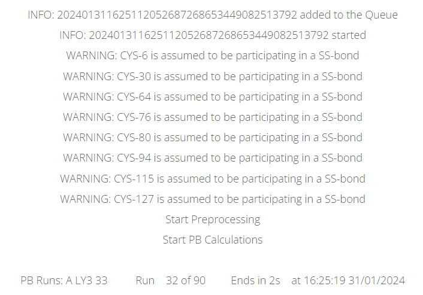

Obtain the results
===================

After submition the calculation will run as soon as there are available computational resources. At it runs the output of PypKa is presented.

On the top left panel there is information displayed regarding the protein and parameters selected. 
Below there are two buttons to download the input PDB file, and the PypKa parameter file used.

Output PDB File
---------------

If the `MD-ready PDB` option was selected at submission time, the top left panel will include an extra button that downloads the output PDB file 
in which the residues are at the most likely protonation at a given pH value.

Titration Curve & Isoelectric Point
-----------------------------------

A titration curve and derived isolectric point are always shown. 
In PypKa, the titration curve is obtained directly from the MC simulation. In the ML models, the titration curve is derived from the p\ :emphasis:`K`\ :sub:`a` values of the residues using the Henderson-Hassdelbalch equation.

The isoelectric point is derived from the titration curve. 
By definition, if at no point of the titration curve the charge is equal to zero, it is not possible to determine the Isoelectric point.

It is possible to download the titration curve as .csv file by clicking the "Download CSV" button at the top.

p\ :emphasis:`K`\ :sub:`a` value of residues
--------------------------------------------

The p\ :emphasis:`K`\ :sub:`a` values of all titratable residues are always shown as a table. The ΔpKa value is the difference between the p\ :emphasis:`K`\ :sub:`a` value of a residue in water and its value in the protein.
The residues that exhibit highly shifted p\ :emphasis:`K`\ :sub:`a` values compared to those in water are highlighed in the table for quicker identification.
Residues with a ΔpKa value greater than \|1.5\| are presented in light orange, and if their shifted is greater than \|2.5\| they are shown in darker orange.
In case the p\ :emphasis:`K`\ :sub:`a` value is not within the selected range of pH values, it can not be estimated and a "-" is displayed.

