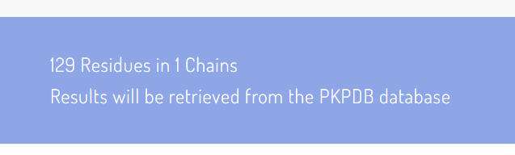
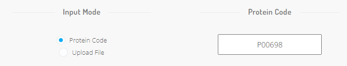
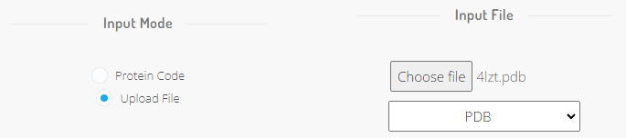
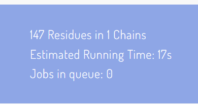
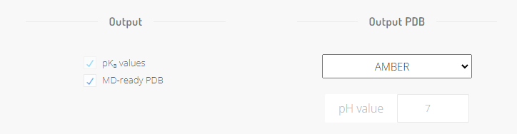

Submit a calculation
====================

To submit a new PypKa calculation go to `pypka.org/run-pypka <https://pypka.org/run-pypka/>`_.

Input Protein
-------------

Through the server it is possible to calculate p\ :emphasis:`K`\ :sub:`a` of proteins using a PDB or UniProt protein code.

To use the `4LZT structure <https://www.rcsb.org/structure/4LZT>`_ of the hen egg-white lysozyme, 
select `Protein Code` as `Input Mode` and type `4LZT` in the Protein Code field:

If you scroll down to the bottom of the page, you will notice a message stating that the "Results will be retrieved from the PKPDB database".
This means that an identical calculation using `4LZT` PDB file was found in the pKPDB database and the returned results will be the result of query instead of a new simulation.
For more information regarding pKPBD please refer to its `original article <https://academic.oup.com/bioinformatics/article/38/1/297/6321453>`_.

Instead of an experimental structure, one can run PypKa on an AlphaFold generated structure. 
In this case, fill the Protein Code field with UniProtKB accession number of the desired protein.
The UniProt code for the hen egg-white lysozyme is `P00698 <https://alphafold.ebi.ac.uk/entry/P00698>`_.

A third option is to upload a local PDB file. When doing so, it is also necessary to specify what is nomenclature of the uploaded file.

Since we are using a custom PDB, it is not possible to query pKPDB.
Now, besides the submission button an estimation of the job running time will be presented as well as the number of jobs already queued.

Select p\ :emphasis:`K`\ :sub:`a` method
----------------------------------------

In the webserver, three methods are available: `Pypka <https://pubs.acs.org/doi/10.1021/acs.jcim.0c00718>`_, `pKAI, and pKAI+ <https://pubs.acs.org/doi/full/10.1021/acs.jctc.2c00308>`_.
pKAI is a machine learning model trained on synthetic p\ :emphasis:`K`\ :sub:`a` values generated with PypKa. It aims to replicate the physics-based PypKa method at a fraction of the computational cost (1000x speed-ups).
pKAI+ is a ML model biased towards less shifted p\ :emphasis:`K`\ :sub:`a` values. It is conceptually analogous to increasing the dielectric constant in PypKa.

In case a large input structure is selected (with more than 1500 residues), only the ML models are available.

Output options
--------------

By default p\ :emphasis:`K`\ :sub:`a` values will be estimated.
However, it is also possible to use the webserver for obtaining a PDB file in which the residues display the most likely protonation state at a given pH value.
In order to obtain such a structure, the user needs to select `MD-ready PDB` in `Output` as well the desired output nomenclature and pH value.

Tweak the PypKa parameters
--------------------------

The default parameters have been `validated <https://pubs.acs.org/doi/10.1021/acs.jcim.0c00718>`_ and are therefore recommend. 
Also, the default parameters are used in the calculations deposited in the pKPBD database. As such, it is only possible to query pKPDB while using the default parameters.

For advanced users, it is possible to change some of the most important parameters including the dielectric constant of the protein or solvent, and the ionic strenght. 

These parameters are only relevant for PypKa, as they are not used by the ML models. pKAI(+) has been trained with p\ :emphasis:`K`\ :sub:`a` values estimated with PypKa using the default parameters.